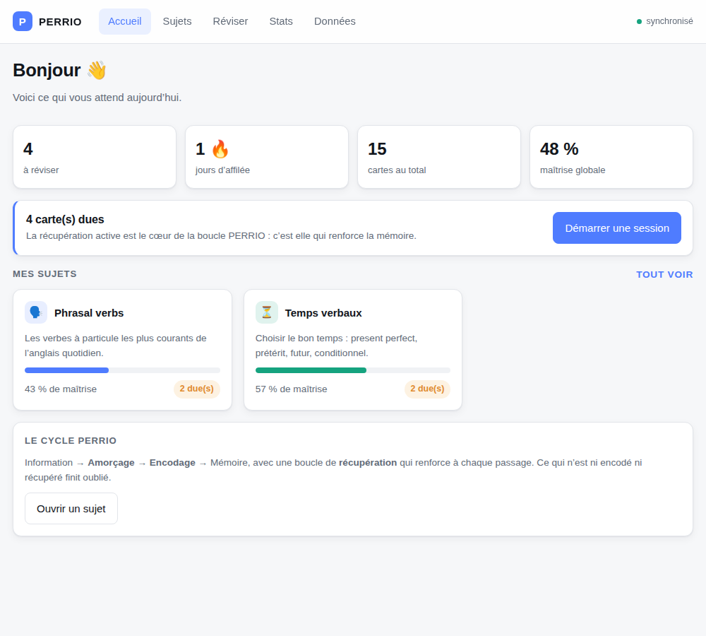
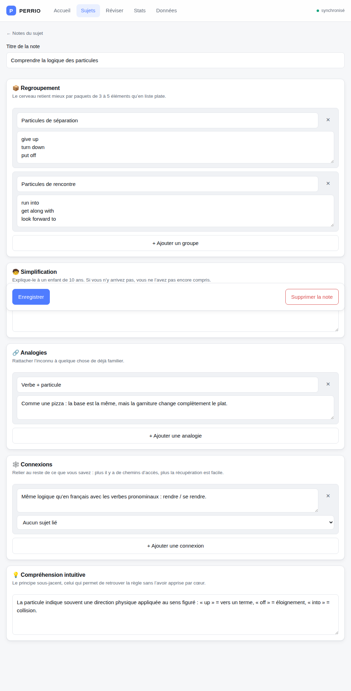
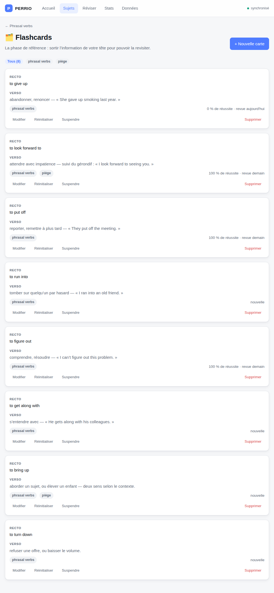
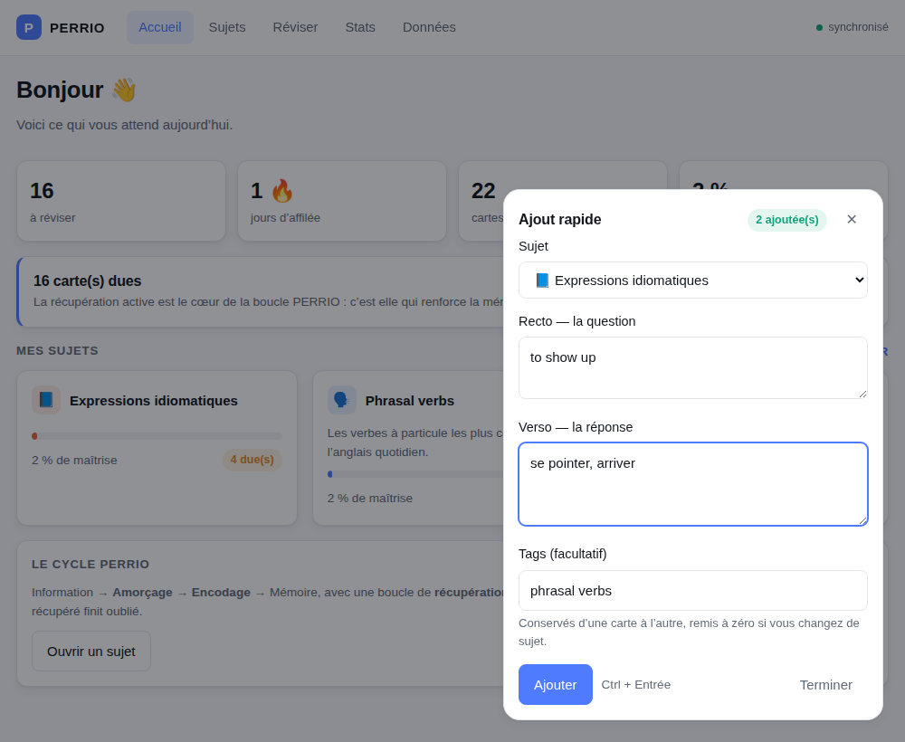
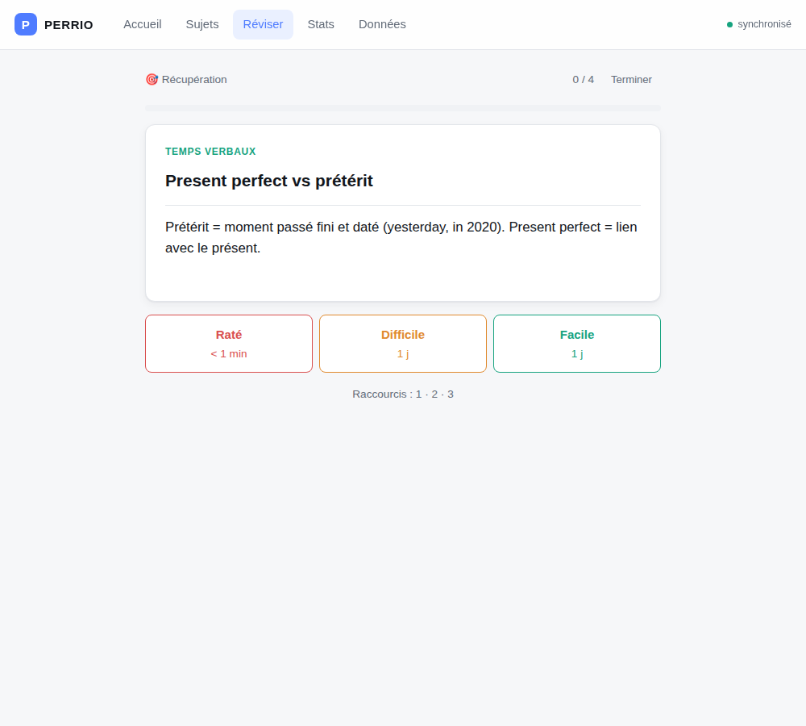
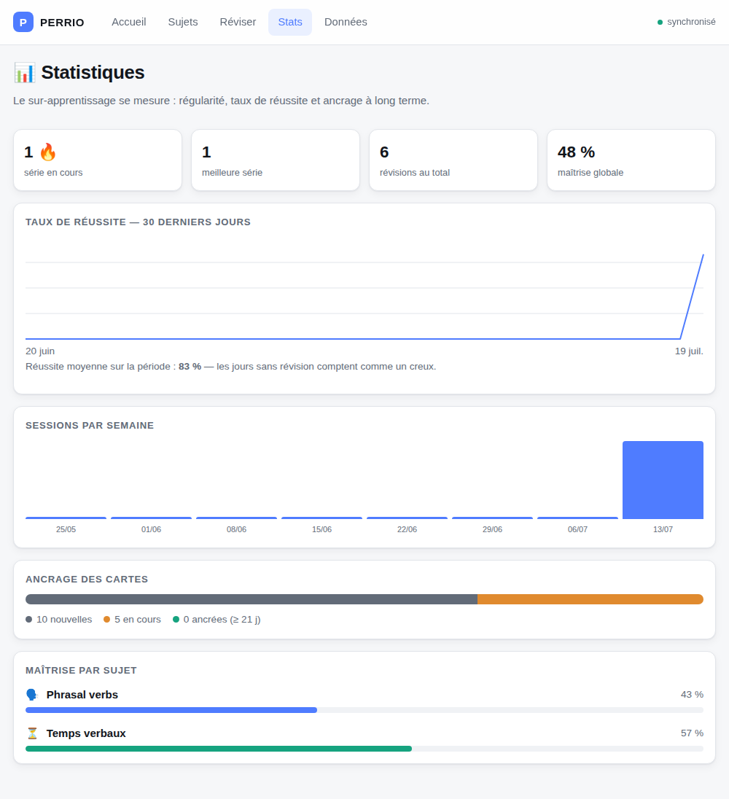
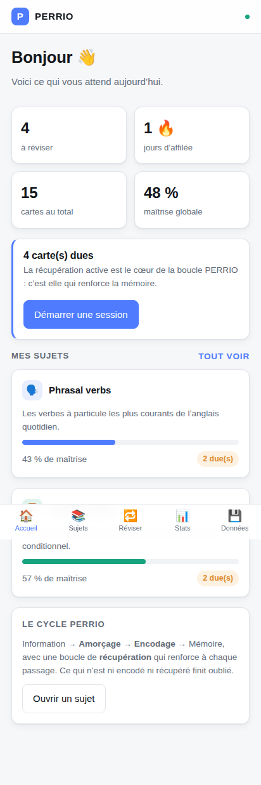

# Guide de PERRIO

Ce que fait l'application et à quoi ressemble chaque écran. Aucune connaissance préalable du projet
n'est nécessaire.

Pour le stockage et le format des données, voir [DONNEES.md](DONNEES.md).

## 1. À quoi sert PERRIO

PERRIO est une application de **révision par cartes mémoire**. On y fabrique des cartes
question / réponse, puis l'application décide chaque jour lesquelles il faut revoir.

Le principe est celui de la **répétition espacée** : une notion qu'on vient d'apprendre s'oublie en
quelques jours, mais chaque fois qu'on parvient à se la remémorer, elle tient plus longtemps.
Plutôt que de tout relire indéfiniment, on ne revoit chaque carte qu'au moment où l'on est sur le
point de l'oublier. Une carte réussie revient dans 1 jour, puis 3, puis 8, puis 20… Une carte ratée
repart du début.

Cela ressemble à Anki ou Quizlet. La différence tient au cadre qui entoure les cartes : PERRIO
n'attaque pas directement la mémorisation, il fait passer chaque sujet par **six étapes** qui
préparent le terrain avant les cartes, puis creusent après.

Le contenu de démonstration porte sur l'anglais — verbes à particule et temps verbaux — mais
l'application est indifférente au domaine : elle marche aussi bien pour du droit, de l'anatomie ou
des commandes Docker.

---

## 2. Le système PERRIO en deux minutes

PERRIO est l'acronyme de six processus d'apprentissage. Le raisonnement de départ tient en une
phrase :

> Une information vue passe par un **amorçage** puis un **encodage** avant d'atteindre la mémoire ;
> chaque **récupération** réussie renforce sa trace. Ce qui n'est ni encodé ni récupéré est oublié.

| | Étape | Ce que ça veut dire | Ce que fait l'application |
|---|---|---|---|
| **P** | Priming — Amorçage | Préparer le cerveau *avant* d'étudier, pour qu'il ait des crochets où accrocher la suite | Trois questions à remplir en deux minutes |
| **E** | Encoding — Encodage | Organiser l'information au lieu de l'avaler brute | Un éditeur de notes en cinq sections |
| **R** | Reference — Référence | Déposer l'information quelque part pour pouvoir y revenir | La création des flashcards |
| **R** | Retrieval — Récupération | Se tester activement : c'est l'effort de rappel qui ancre, pas la relecture | Le mode révision |
| **I** | Interleaving — Entrelacement | Alterner les sujets au lieu de bloquer sur un seul | La session mixte |
| **O** | Overlearning — Sur-apprentissage | Continuer au-delà du « je crois que je sais » | L'indicateur de maîtrise |

L'ordre est une progression logique, pas une contrainte : rien n'oblige à faire l'amorçage avant de
créer des cartes. L'application affiche simplement où en est chaque sujet.

---

## 3. Visite guidée des écrans

Les captures ci-dessous proviennent de l'application réelle, remplie avec le contenu de
démonstration.

### 3.1 Tableau de bord — la page d'accueil

Elle répond à une seule question : *qu'est-ce que je fais maintenant ?*

- **À réviser** — le nombre de cartes dont la date de révision est arrivée. C'est le seul chiffre
  qui compte au quotidien.
- **Jours d'affilée** — la série. Un jour compte dès qu'au moins une session a eu lieu ; elle
  survit à la journée en cours tant qu'on a étudié la veille.
- **Cartes au total** et **maîtrise globale** — l'état d'ensemble.

En dessous, chaque sujet affiche sa barre de maîtrise et le nombre de cartes qui l'attendent. Le
bouton **Démarrer une session** n'apparaît que s'il y a effectivement quelque chose à réviser.

### 3.2 Page d'un sujet — le pipeline PERRIO

C'est l'écran caractéristique de l'application. Les six étapes sont présentées comme un chemin :
celles qui sont entamées portent une coche colorée, les autres un numéro gris. À droite de chaque
étape, un compteur dit où l'on en est — *1 amorçage*, *8 cartes*, *4 révisions*.

En haut, la **maîtrise** du sujet est décomposée en ses trois composantes (réussite, ancrage,
régularité) pour qu'un pourcentage bas soit interprétable : 43 % avec « ancrage 0 % » ne signifie
pas qu'on répond mal, mais que les cartes sont encore jeunes.

Chaque étape a son bouton d'action, et toutes sont accessibles à tout moment.

### 3.3 Amorçage — trois questions avant de commencer

Trois champs libres : *Que sais-je déjà ?*, *Qu'est-ce que je veux apprendre ?*, *Pourquoi c'est
important ?*

L'intérêt n'est pas dans ce qu'on écrit mais dans le fait de l'écrire : formuler ce qu'on sait déjà
réactive les connaissances existantes, et se donner un objectif précis vaut mieux que « tout
comprendre ». Chaque amorçage est horodaté et conservé — relire ceux d'il y a un mois montre le
chemin parcouru.

### 3.4 Encodage — cinq façons de digérer l'information

Un éditeur de notes découpé en cinq sections, une par méthode d'encodage :

1. **Regroupement** — ranger par paquets de 3 à 5 plutôt qu'en liste plate.
2. **Simplification** — l'expliquer à un enfant de 10 ans. Si on n'y arrive pas, on ne l'a pas
   compris.
3. **Analogies** — rattacher l'inconnu à du familier.
4. **Connexions** — relier à d'autres sujets, éventuellement par un lien explicite vers l'un d'eux.
5. **Compréhension intuitive** — le principe sous-jacent, celui qui permet de retrouver la règle
   sans l'avoir apprise par cœur.

Ces sections sont un garde-fou : laissé libre, on recopie le cours ; contraint par cinq cases, on
est obligé de le transformer.

### 3.5 Flashcards — la mémoire externe

Les cartes recto / verso du sujet. Chacune peut porter des **tags** (ici *phrasal verbs*, *piège*),
qui servent à filtrer la liste.

Sous chaque carte figure son état : *nouvelle*, ou bien son taux de réussite et la date de sa
prochaine apparition. Trois actions sont disponibles : **Modifier**, **Réinitialiser** (la carte
repart de zéro dans le cycle de répétition) et **Suspendre** (elle sort des révisions sans être
supprimée).

### 3.6 Ajout rapide — le bouton « + »

Un bouton rond flotte en bas à droite de tous les écrans. Il ouvre un formulaire réduit : sujet,
recto, verso, tags — de quoi créer une carte sans quitter la page où l'on se trouve.

Il est conçu pour la **saisie en série**. Après validation, seuls le recto et le verso se vident :
le sujet et les tags restent, et le curseur revient sur le recto. On enchaîne ainsi dix mots de
vocabulaire sans jamais toucher à la souris. Un compteur indique combien de cartes ont été ajoutées
depuis l'ouverture.

Si le sujet voulu n'existe pas encore, l'option **＋ Nouveau sujet…** le crée à la volée, avec une
couleur prise dans la palette. Les cartes suivantes y sont versées sans le recréer.

Au clavier : `N` ouvre le formulaire, `Ctrl + Entrée` valide, `Échap` ferme. Le bouton s'efface
pendant une session de révision, où il masquerait les boutons de notation.

### 3.7 Réviser — le choix de la session

Deux modes :

- **Récupération** — un ou plusieurs sujets, cartes mélangées au hasard.
- **Session mixte** — les cartes alternent d'un sujet à l'autre à chaque question. C'est
  volontairement plus difficile : passer sans arrêt d'un contexte à l'autre oblige à identifier de
  quoi il s'agit avant de répondre, ce qui ancre mieux qu'une série homogène.

La liste des sujets indique combien de cartes chacun a de dues, et le total prêt à être révisé.

### 3.8 En session

Une carte s'affiche, question seule. On essaie de répondre **de tête** — c'est l'effort de rappel
qui fait tout le travail — puis on révèle la réponse et on s'auto-évalue :

| Bouton | Quand l'utiliser | Effet |
|---|---|---|
| **Raté** | Je ne savais pas | La carte revient avant la fin de la session |
| **Difficile** | Retrouvé, mais péniblement | Intervalle à peine allongé |
| **Facile** | Immédiat | Intervalle nettement allongé |

Chaque bouton affiche le délai qu'il déclenche, donc aucune surprise. Au clavier : `Espace` révèle,
puis `1`, `2`, `3`.

À la fin, un bilan récapitule le nombre de révisions et le taux de réussite.

### 3.9 Statistiques

Quatre indicateurs en tête, puis :

- **Taux de réussite sur 30 jours** — les jours sans révision comptent comme un creux, la courbe
  reflète donc autant la régularité que la performance.
- **Sessions par semaine** — la constance sur deux mois.
- **Ancrage des cartes** — la répartition entre *nouvelles*, *en cours* et *ancrées*. Une carte est
  dite ancrée quand son intervalle a dépassé 21 jours. C'est l'indicateur le plus honnête :
  tant que la barre verte est vide, rien n'est encore acquis à long terme.
- **Maîtrise par sujet** — où concentrer l'effort.

### 3.10 Données

L'inventaire de ce que contient l'espace, l'export et l'import d'une sauvegarde JSON, et la
réinitialisation complète. Le fonctionnement détaillé de ces opérations fait l'objet de la partie II.

### 3.11 Sur téléphone

L'interface est conçue pour le mobile d'abord : la navigation passe en bas de l'écran, à portée de
pouce. L'application s'installe depuis le navigateur (Chrome → *Ajouter à l'écran d'accueil*) et
s'ouvre alors en plein écran, comme une application native.

---

## 4. D'où viennent les chiffres

### La planification des révisions

L'algorithme est une version simplifiée de **SM-2**, celui d'Anki. Chaque carte porte un
*intervalle* (dans combien de jours la revoir) et une *facilité* (à quel point elle est aisée pour
vous, de 1,3 à 2,8 — départ à 2,5).

| Note | Intervalle | Facilité |
|---|---|---|
| Raté | remis à zéro, la carte revient dans la session | −0,20 |
| Difficile | × 1,2 | −0,15 |
| Facile | 1 jour, puis 3 jours, puis × facilité | +0,10 |

Une carte souvent ratée voit sa facilité baisser, donc ses intervalles se resserrer : elle revient
plus souvent, automatiquement. À l'inverse, une carte maîtrisée s'espace vite et cesse d'encombrer.

Détail qui surprend au début : sur une carte neuve, *Difficile* et *Facile* donnent tous deux
1 jour. Les intervalles ne divergent qu'à partir de la deuxième réussite.

### La maîtrise d'un sujet

Un pourcentage de 0 à 100, pondéré ainsi :

| Poids | Composante | Mesure |
|---|---|---|
| 55 % | Réussite | Part de réponses non ratées sur les 20 dernières révisions |
| 30 % | Ancrage | Part des cartes ayant dépassé 21 jours d'intervalle |
| 15 % | Régularité | Jours étudiés sur les 14 derniers |

Le badge **🏆 Maîtrisé** apparaît à partir de 85 %, et seulement avec au moins 10 cartes et
3 sessions — sans quoi un sujet d'une seule carte réussie afficherait la maîtrise maximale.

La composante *ancrage* est ce qui empêche de tricher : elle ne peut monter qu'avec le temps, aucune
session intensive ne la fait bouger en un jour.

### La série

Le nombre de jours consécutifs comportant au moins une session. Elle ne se casse pas parce qu'on n'a
pas encore étudié aujourd'hui : tant qu'on a étudié hier, elle tient.

---
